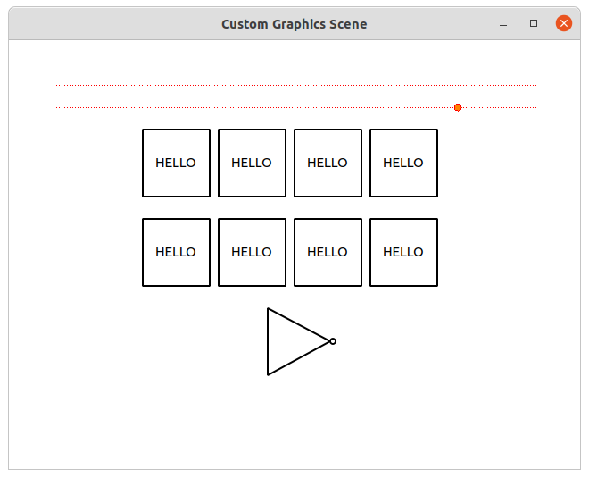

# Schematic Editor
Schematic Editor based on Custom QWidget based [Graphics Scene](https://github.com/PyQtWorks/GraphicsScene_V0).

You can:
- move mouse over dotted guide lines to place nodes over them
- toggle the above functionality using keyboard shortcut w

